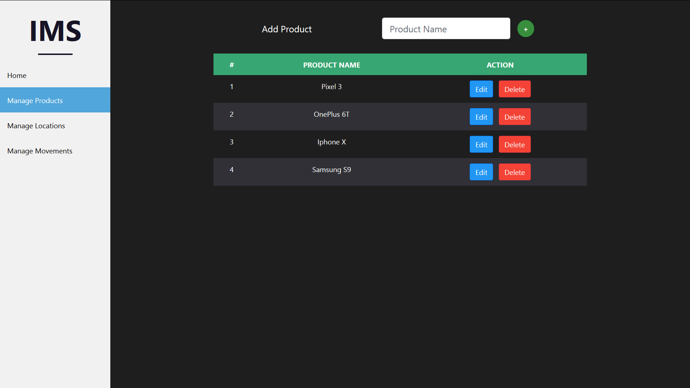
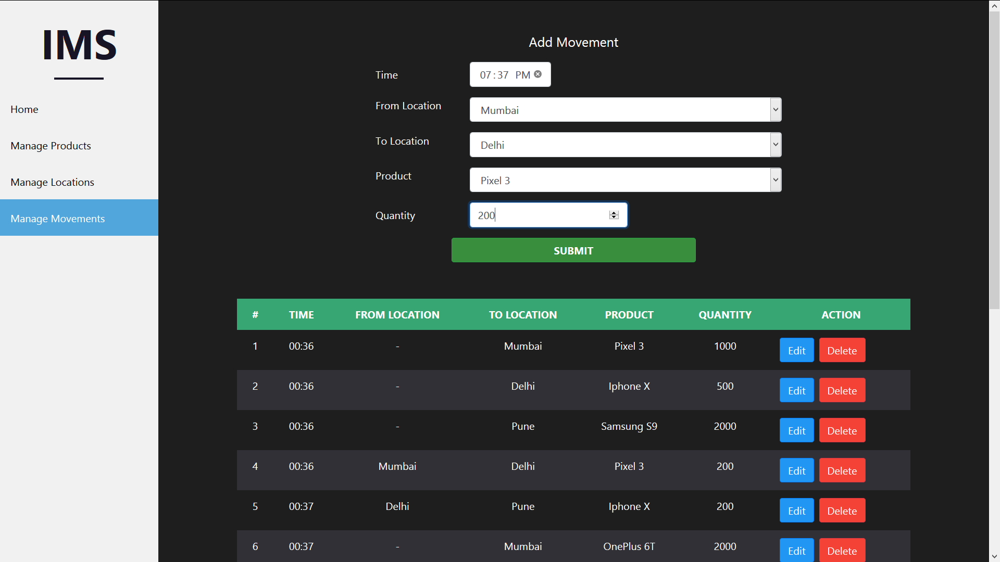
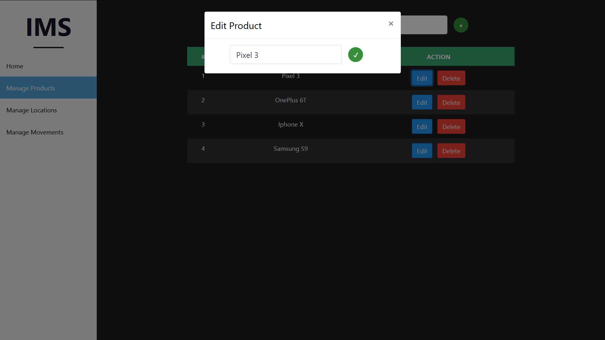
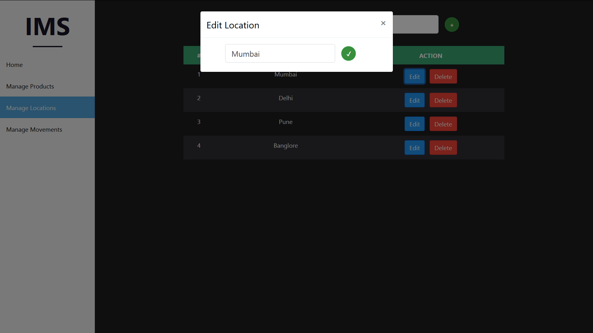

# Inventory-Management-System---Flask
An Inventory Management System developed using Flask

Features:
Add/Edit/Delete Products
Add/Edit/Delete Locations
Add/Edit/Delete ProductMovements
Real Time Reports

How To Run:
1. Open  terminal/command prompt in project's root folder

2. Install Virtual Environment:
pip install virtualenv  
(Add sudo before pip on Linux/Mac OS)  
(If you are on Windows, log in as Administrator)  

2. Add Virtual Environent: 
Linux & Others: python3 -m venv venv  
Windows: py -3 -m venv venv  

3. Activate Virtual Environment:  
Linux & Others: . venv/bin/activate  
Windows: venv\Scripts\activate  
 
4. Install Flask:  
pip install Flask  

5. Run:  
Linux & Others:$ export FLASK_APP=home.py  
$ flask run  
Windows: set FLASK_ENV=development  
set FLASK_APP=home.py  
flask run  

6. Open http://127.0.0.1:5000/ in your browser (default link unless you change something in flask)
     

Screenshots:

• Dashboard:

• Manage Products:

• Manage Location

• Manage Movement

• Edit Product

• Edit Location

• Edit Movement

